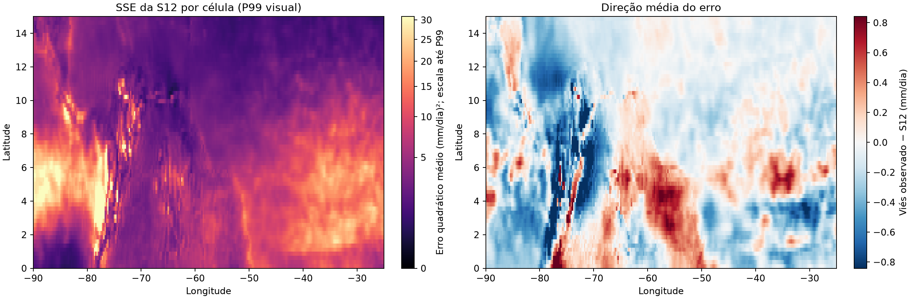
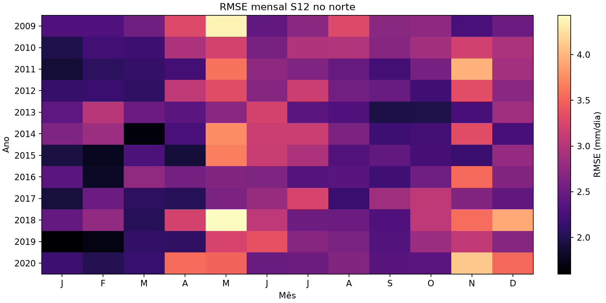
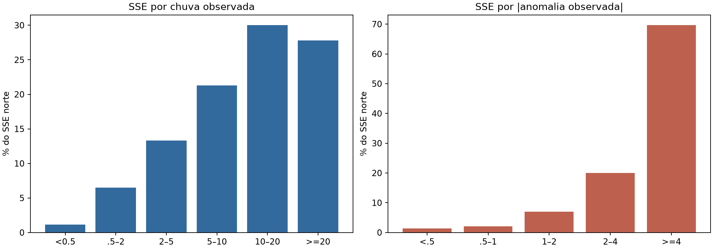
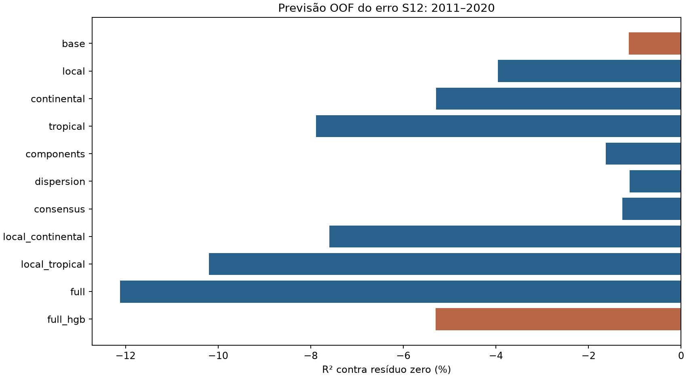
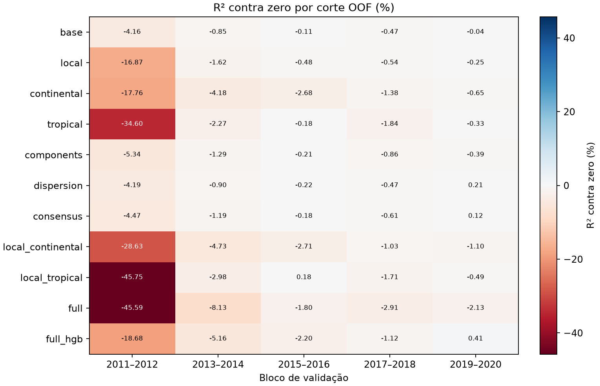
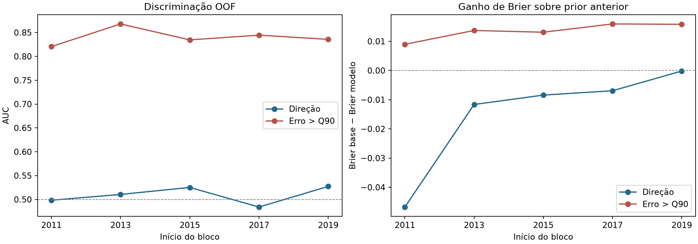
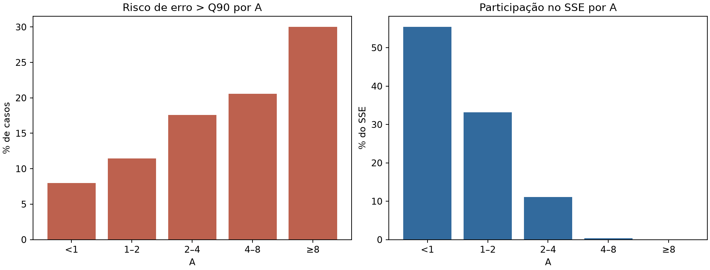

# Rodada 26: previsibilidade do erro comum S12 no norte

**Conclusão predefinida: C.** Nenhum grupo passou os critérios globais de A nem os critérios de setor/estação estável de B. Direção: 0/5 blocos com AUC/Brier úteis; Q90: 5/5 blocos com AUC/lift/Brier úteis.

## Delineamento e validade

Referência fixa S12; resíduo = observado − S12. Região 0 a 15°N, 15,921 células por mês. Os seis blocos de 2009 a 2020 entram no diagnóstico descritivo. O primeiro bloco (2009 a 2010) não pode receber uma previsão de resíduo temporalmente OOF, pois não há resíduos S12 OOF anteriores. Os cinco blocos seguintes são avaliados com treino expansivo apenas em blocos anteriores. Foram usados 512 pontos norte por mês de treino, e todas as células na validação.

Climatologia, médias meteorológicas, PCs, padronização e limiares de extremo são ajustados antes de cada corte. O mesmo referencial PCA do corte transforma os meses históricos e o bloco avaliado. As medidas por pixel não representam réplicas independentes; os blocos e anos mostram a estabilidade temporal. Os dados de 2023/2024 e o leaderboard não foram consultados nesta rodada.

## 1. Onde está o erro da S12?

RMSE norte nos seis blocos: **2.708 mm/dia**; viés observado − S12: **-0.103 mm/dia**. Q90 descritivo |r| = 4.134; Q95 = 5.696 mm/dia. Esses quantis globais só descrevem o período; cada corte preditivo usa seu próprio limiar anterior.

| Fração de pontos de maior erro | Fração do SSE norte |
| --- | ---: |
| 1% | 24.63% |
| 5% | 53.54% |
| 10% | 69.49% |

### Divisão espacial e temporal

Cada coluna de SSE soma 100% dentro de seu agrupamento; a fração de pontos ajuda a distinguir concentração de área extensa.

| Dimensão | Faixa | Pontos | SSE | RMSE | Viés | P(subestimação) |
| --- | --- | ---: | ---: | ---: | ---: | ---: |
| latitude_5deg | 0 a 5°N | 32.79% | 47.25% | 3.251 | -0.102 | 42.78% |
| latitude_5deg | 5 a 10°N | 32.79% | 39.79% | 2.983 | -0.090 | 39.54% |
| latitude_5deg | 10 a 15°N | 34.43% | 12.95% | 1.661 | -0.116 | 37.32% |
| longitude_10deg | 90 a 80°W | 15.33% | 21.64% | 3.218 | -0.187 | 37.60% |
| longitude_10deg | 80 a 70°W | 15.33% | 18.80% | 2.999 | -0.385 | 37.23% |
| longitude_10deg | 70 a 60°W | 15.33% | 7.14% | 1.848 | -0.012 | 43.29% |
| longitude_10deg | 60 a 50°W | 15.33% | 8.75% | 2.046 | 0.117 | 45.01% |
| longitude_10deg | 50 a 40°W | 15.33% | 12.68% | 2.463 | -0.076 | 41.36% |
| longitude_10deg | 40 a 30°W | 15.33% | 20.81% | 3.155 | -0.047 | 37.32% |
| longitude_10deg | 30 a 25°W | 8.05% | 10.18% | 3.046 | -0.153 | 34.52% |
| sector | oeste | 30.65% | 40.45% | 3.110 | -0.286 | 37.41% |
| sector | centro | 30.65% | 15.89% | 1.949 | 0.053 | 44.15% |
| sector | leste | 38.70% | 43.67% | 2.876 | -0.081 | 38.34% |
| season | DJF | 25.00% | 20.82% | 2.471 | -0.137 | 36.05% |
| season | MAM | 25.00% | 27.56% | 2.843 | -0.059 | 40.72% |
| season | JJA | 25.00% | 25.88% | 2.755 | -0.098 | 40.50% |
| season | SON | 25.00% | 25.74% | 2.747 | -0.117 | 42.08% |

### Matriz latitude × longitude

Cada célula mostra a fração do SSE total norte nos seis blocos.

| Latitude / longitude | 90 a 80°W | 80 a 70°W | 70 a 60°W | 60 a 50°W | 50 a 40°W | 40 a 30°W | 30 a 25°W |
| --- | ---: | ---: | ---: | ---: | ---: | ---: | ---: |
| 0 a 5°N | 6.94% | 9.47% | 3.41% | 4.92% | 6.78% | 10.79% | 4.96% |
| 5 a 10°N | 10.83% | 6.85% | 2.43% | 2.72% | 4.53% | 8.19% | 4.24% |
| 10 a 15°N | 3.87% | 2.49% | 1.30% | 1.11% | 1.37% | 1.84% | 0.98% |

### Ano

| Ano | SSE norte | RMSE | Viés |
| ---: | ---: | ---: | ---: |
| 2009 | 9.24% | 2.851 | -0.654 |
| 2010 | 8.67% | 2.763 | 0.184 |
| 2011 | 8.21% | 2.687 | 0.323 |
| 2012 | 8.27% | 2.697 | 0.042 |
| 2013 | 7.26% | 2.527 | -0.160 |
| 2014 | 8.50% | 2.734 | -0.133 |
| 2015 | 7.26% | 2.527 | -0.183 |
| 2016 | 7.50% | 2.569 | -0.198 |
| 2017 | 7.48% | 2.566 | 0.101 |
| 2018 | 10.64% | 3.060 | -0.024 |
| 2019 | 7.62% | 2.589 | -0.330 |
| 2020 | 9.35% | 2.868 | -0.202 |

### Intensidade observada e anomalia observada

Estas duas variáveis são rótulos diagnósticos obtidos com a chuva real; não são elegíveis como sinal para um modelo operacional.

| Critério | Faixa (mm/dia) | Pontos | SSE | RMSE |
| --- | --- | ---: | ---: | ---: |
| observed_intensity | <0,5 | 14.45% | 1.12% | 0.755 |
| observed_intensity | 0,5 a 2 | 20.37% | 6.48% | 1.527 |
| observed_intensity | 2 a 5 | 21.62% | 13.33% | 2.127 |
| observed_intensity | 5 a 10 | 25.47% | 21.29% | 2.476 |
| observed_intensity | 10 a 20 | 15.73% | 30.00% | 3.739 |
| observed_intensity | ≥20 | 2.36% | 27.77% | 9.281 |
| abs_observed_anomaly | <0,5 | 29.79% | 1.32% | 0.570 |
| abs_observed_anomaly | 0,5 a 1 | 17.07% | 2.05% | 0.938 |
| abs_observed_anomaly | 1 a 2 | 21.90% | 7.01% | 1.532 |
| abs_observed_anomaly | 2 a 4 | 19.49% | 20.01% | 2.743 |
| abs_observed_anomaly | ≥4 | 11.74% | 69.61% | 6.592 |

Os cinco componentes erram no mesmo sentido em 68.94% dos pontos norte; esses pontos reúnem 98.72% do SSE. Essa condição depende do observado e serve apenas para descrever o erro. A série completa de 12 meses e a decomposição cruzada estão em [diagnostic.json](diagnostic.json).

Os mapas e perfis permitem ver a geometria do erro:

## 2. Resíduo previsível em blocos OOF?

R² contra zero mede redução do SSE da S12; valor negativo significa piora. A base inclui localização, mês, climatologia e S12. Cada linha adiciona a família indicada à mesma base. O HGB é apenas uma checagem não linear fixa.

| Grupo | R² zero | Δ vs base (p.p.) | RMSE r | Correlação | Blocos positivos | Anos positivos |
| --- | ---: | ---: | ---: | ---: | ---: | ---: |
| base | -1.13% | +0.000 | 2.703 | -0.056 | 0/5 | 2/10 |
| local | -3.96% | -2.824 | 2.740 | -0.048 | 0/5 | 1/10 |
| continental | -5.29% | -4.157 | 2.758 | -0.046 | 0/5 | 0/10 |
| tropical | -7.88% | -6.753 | 2.791 | -0.041 | 0/5 | 1/10 |
| components | -1.63% | -0.495 | 2.709 | -0.062 | 0/5 | 1/10 |
| dispersion | -1.11% | +0.018 | 2.702 | -0.054 | 1/5 | 3/10 |
| consensus | -1.27% | -0.136 | 2.704 | -0.055 | 1/5 | 3/10 |
| local_continental | -7.59% | -6.463 | 2.788 | -0.041 | 0/5 | 0/10 |
| local_tropical | -10.20% | -9.065 | 2.821 | -0.039 | 1/5 | 1/10 |
| full | -12.12% | -10.986 | 2.846 | -0.050 | 0/5 | 0/10 |
| full_hgb | -5.30% | -4.169 | 2.758 | -0.053 | 1/5 | 3/10 |

### Onde o sinal aparece ou desaparece

A tabela abaixo mostra os melhores subconjuntos espaciais e sazonais predefinidos. É uma análise exploratória entre vários grupos, e nenhuma linha isolada estabelece ganho norte inteiro.

| Grupo | Setor/estação | R² zero | Blocos positivos | Anos positivos |
| --- | --- | ---: | ---: | ---: |
| dispersion | west | -0.12% | 2/5 | 5/10 |
| base | west | -0.19% | 2/5 | 5/10 |
| dispersion | JJA | -0.22% | 2/5 | 5/10 |
| base | JJA | -0.26% | 1/5 | 5/10 |
| consensus | west | -0.30% | 2/5 | 5/10 |
| consensus | JJA | -0.36% | 1/5 | 3/10 |
| base | SON | -0.64% | 2/5 | 4/10 |
| dispersion | SON | -0.64% | 2/5 | 4/10 |
| components | JJA | -0.68% | 2/5 | 2/10 |
| consensus | SON | -0.69% | 2/5 | 4/10 |
| components | west | -0.82% | 2/5 | 4/10 |
| components | SON | -1.08% | 2/5 | 2/10 |

Os resultados de todas as áreas, blocos e anos estão em [summary.json](summary.json).

## 3. Direção do erro

Subestimação significa observado > S12. As tabelas condicionais por mês, latitude, longitude e quintis de atributos disponíveis em inferência estão em [summary.json](summary.json), campo `conditional_pooled`; os limites dos quintis vêm do treino anterior a cada corte. A classificação binária usa Ridge com o conjunto completo, com prior constante aprendido anteriormente.

| Bloco | P(subestimação) | AUC direção | Ganho Brier direção | P(erro > Q90) | AUC Q90 | AP Q90 | Lift decil Q90 | Ganho Brier Q90 |
| --- | ---: | ---: | ---: | ---: | ---: | ---: | ---: | ---: |
| 2011 a 2012 | 45.69% | 0.498 | -0.04676 | 8.31% | 0.820 | 0.307 | 3.87× | 0.00896 |
| 2013 a 2014 | 38.46% | 0.511 | -0.01164 | 8.82% | 0.868 | 0.366 | 4.46× | 0.01370 |
| 2015 a 2016 | 39.50% | 0.525 | -0.00843 | 9.39% | 0.835 | 0.342 | 4.00× | 0.01311 |
| 2017 a 2018 | 42.75% | 0.484 | -0.00694 | 10.70% | 0.844 | 0.373 | 3.84× | 0.01594 |
| 2019 a 2020 | 32.74% | 0.527 | -0.00019 | 10.73% | 0.836 | 0.371 | 3.72× | 0.01581 |

### Taxas condicionais de subestimação e de erro crítico

As faixas 0 e 4 são os extremos dos quintis definidos no treino de cada corte. As frequências são agregadas nos cinco blocos OOF; uma diferença entre bins não garante discriminação temporal útil.

| Atributo | Bin | P(subestimação) | P(erro > Q90) | RMSE |
| --- | ---: | ---: | ---: | ---: |
| climatology | 0 | 36.27% | 0.18% | 0.551 |
| climatology | 4 | 44.87% | 28.49% | 4.470 |
| s12_anomaly | 0 | 38.26% | 8.45% | 2.527 |
| s12_anomaly | 4 | 44.71% | 27.55% | 4.486 |
| member_std | 0 | 40.52% | 1.70% | 1.350 |
| member_std | 4 | 40.39% | 24.37% | 4.186 |
| consensus_ratio | 0 | 39.52% | 7.31% | 2.346 |
| consensus_ratio | 4 | 41.24% | 15.21% | 3.315 |

## 4. Extremos Q90 e Q95

Cada Q90/Q95 é calculado com resíduos S12 OOF de todos os blocos norte anteriores, sem usar o bloco avaliado. AUC, average precision, Brier e lift se referem ao evento Q90; Q95 recebe somente comparação descritiva. AP deve ser lido junto à prevalência do próprio bloco. Diferença padronizada de média (extremo menos normal, em desvios combinados) por feature e corte está em [summary.json](summary.json), campo `extreme_contrasts_by_fold`. A distribuição em quintis aparece em `conditional_pooled`. Esses contrastes usam os rótulos reais para caracterizar o erro; só features disponíveis antes da previsão entraram no classificador.

| Bloco | Q90 anterior | Q95 anterior | Eventos Q90 | Eventos Q95 |
| --- | ---: | ---: | ---: | ---: |
| 2011 a 2012 | 4.388 | 6.157 | 8.31% | 3.83% |
| 2013 a 2014 | 4.195 | 5.831 | 8.82% | 4.27% |
| 2015 a 2016 | 4.111 | 5.711 | 9.39% | 4.50% |
| 2017 a 2018 | 4.078 | 5.649 | 10.70% | 5.38% |
| 2019 a 2020 | 4.108 | 5.688 | 10.73% | 5.10% |

Os maiores contrastes médios Q90 entre cinco blocos (positivo = maior entre extremos):

| Atributo | Diferença padronizada média | Faixa entre blocos |
| --- | ---: | ---: |
| climatology | +1.047 | +0.993 a +1.120 |
| local_context_12 | +0.865 | +0.825 a +0.909 |
| local_context_7 | +0.860 | +0.789 a +0.903 |
| member_std | +0.812 | +0.747 a +0.907 |
| local_context_6 | +0.697 | +0.639 a +0.743 |
| local_context_9 | +0.572 | +0.539 a +0.589 |
| local_context_13 | -0.533 | -0.588 a -0.409 |
| s12_anomaly | +0.462 | +0.320 a +0.647 |

A climatologia e a dispersão entre componentes têm forte associação marginal com a criticidade. O valor previsto e a climatologia já são capazes de ordenar parte substancial do risco; a seção final distingue esse efeito de ganho novo dos atributos adicionais.

## 5. Consenso excessivo

A = |média dos componentes − climatologia| / (desvio padrão dos componentes + 0,1). Erro simultâneo no mesmo sentido de todos os componentes é diagnóstico baseado no observado, jamais feature. O risco abaixo usa Q90 anterior de cada corte, e cobre 2011 a 2020.

| A | Pontos | RMSE | Risco Q90 | P(subestimação) | SSE |
| --- | ---: | ---: | ---: | ---: | ---: |
| <1 | 1,253,336 | 2.470 | 8.01% | 39.27% | 55.41% |
| 1 a 2 | 535,421 | 2.924 | 11.47% | 40.69% | 33.19% |
| 2 a 4 | 118,885 | 3.585 | 17.57% | 41.85% | 11.07% |
| 4 a 8 | 2,858 | 4.002 | 20.57% | 41.64% | 0.33% |
| ≥8 | 20 | 4.489 | 30.00% | 60.00% | 0.00% |

### A condicionado ao nível climatológico

Risco Q90 em três faixas de A, dentro de cada classe de climatologia. As células com poucos casos devem ser lidas com cautela.

| Climatologia (mm/dia) | A<1 | A 1 a 2 | A 2 a 4 |
| --- | ---: | ---: | ---: |
| <2 | 0.39% (n=420,490) | 0.31% (n=101,379) | 0.97% (n=14,330) |
| 2 a 5 | 3.26% (n=320,402) | 2.70% (n=144,557) | 4.15% (n=26,842) |
| 5 a 10 | 11.77% (n=342,305) | 12.36% (n=174,658) | 15.91% (n=41,268) |
| ≥10 | 28.19% (n=170,139) | 30.99% (n=114,827) | 35.87% (n=36,445) |

O cruzamento de A com climatologia e magnitude da anomalia prevista está em [summary.json](summary.json), campo `consensus_pooled`. Uma associação que desapareça após essa estratificação não sugere sinal novo de consenso.

## Juízo científico

A checagem adicional abaixo, calculada depois do teste principal e sem ajustar pesos, mostra quanta discriminação de Q90 já existe nas referências de intensidade chuvosa. AUC é independente de calibração; climatologia e S12 entram apenas como ordenadores fixos.

| Bloco | AUC climatologia | AUC S12 | AUC classificador completo |
| --- | ---: | ---: | ---: |
| 2011 a 2012 | 0.819 | 0.826 | 0.820 |
| 2013 a 2014 | 0.849 | 0.854 | 0.868 |
| 2015 a 2016 | 0.828 | 0.834 | 0.835 |
| 2017 a 2018 | 0.829 | 0.834 | 0.844 |
| 2019 a 2020 | 0.823 | 0.827 | 0.836 |

A maior parte da ordenação do risco crítico já aparece na climatologia e na própria S12; o incremento do classificador completo é pequeno e nem sempre positivo frente à S12 simples. A verificação de hashes, resíduos, limiares e escores está em [audit.json](audit.json).

**Classificação C para o valor do resíduo.** Nenhum grupo passou os critérios globais de A nem os critérios de setor/estação estável de B. Direção: 0/5 blocos com AUC/Brier úteis; Q90: 5/5 blocos com AUC/lift/Brier úteis.

Há previsibilidade do **risco de erro extremo**, principalmente associada ao regime chuvoso, mas não se obteve uma previsão estável da direção nem redução OOF do SSE por correção do valor do resíduo. Para um eventual ensaio futuro, um indicador de incerteza deve ser comparado a climatologia e intensidade S12, validado em blocos posteriores e separado de qualquer correção/gating de previsão. O gradiente bruto de A não demonstrou ganho incremental estável.

Este é um estudo exploratório em blocos históricos reutilizados na construção do projeto; há viés de seleção. Nenhuma correção foi somada à S12, nenhum gating foi construído e nenhuma candidata foi criada. [Protocolo](../../../experiments/ROUND26.md).
