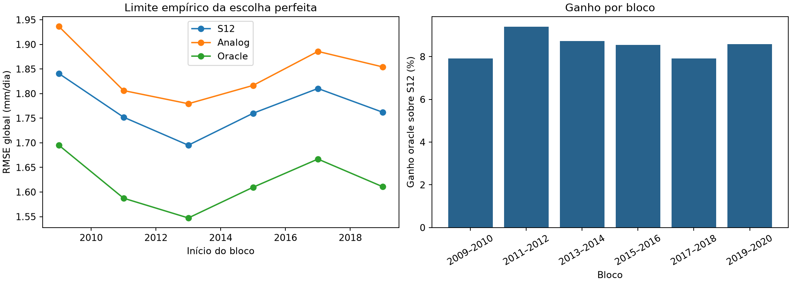
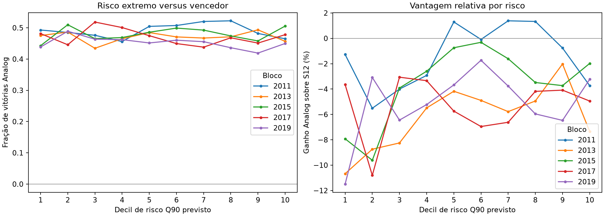
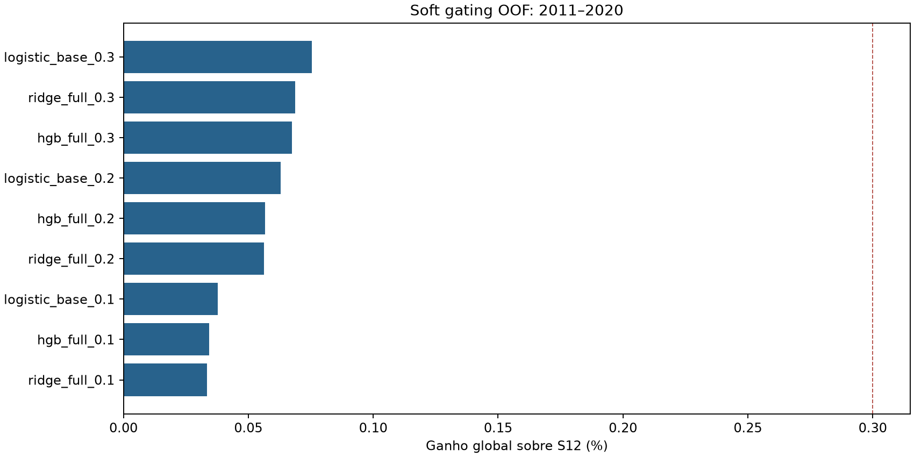

# Rodada 27: seleção S12 versus análogos

**Decisão predefinida: D.** Há ganho em algumas combinações, mas nenhuma satisfaz amplitude e estabilidade de A.

## Escopo e limite empírico

S12 e análogo puro H4 são previsões OOF congeladas. O oracle acessa o observado para escolher o menor erro em cada célula; esse resultado é somente um limite diagnóstico de escolha perfeita entre os dois mapas. O ganho relevante foi definido antes dos cálculos como ≥0,3% global e ≥1,0% norte.

| Região | RMSE S12 | RMSE Analog | RMSE oracle | Vitórias Analog | Ganho oracle |
| --- | ---: | ---: | ---: | ---: | ---: |
| global | 1.771 | 1.847 | 1.620 | 46.72% | 8.49% |
| north | 2.708 | 2.819 | 2.464 | 47.72% | 9.00% |

| Bloco | RMSE S12 | RMSE Analog | RMSE oracle | Vitórias Analog | Ganho oracle |
| --- | ---: | ---: | ---: | ---: | ---: |
| 2009 a 2010 | 1.841 | 1.937 | 1.695 | 47.62% | 7.91% |
| 2011 a 2012 | 1.752 | 1.806 | 1.587 | 47.16% | 9.40% |
| 2013 a 2014 | 1.695 | 1.779 | 1.547 | 45.91% | 8.72% |
| 2015 a 2016 | 1.760 | 1.817 | 1.610 | 46.46% | 8.54% |
| 2017 a 2018 | 1.810 | 1.886 | 1.667 | 47.81% | 7.92% |
| 2019 a 2020 | 1.762 | 1.854 | 1.611 | 45.36% | 8.59% |

### Ano, latitude, setor e estação

| Ano | Ganho oracle global | Ganho oracle norte | Vitórias Analog global |
| ---: | ---: | ---: | ---: |
| 2009 | 7.73% | 8.69% | 48.13% |
| 2010 | 8.14% | 8.55% | 47.11% |
| 2011 | 9.20% | 9.75% | 48.10% |
| 2012 | 9.59% | 10.09% | 46.21% |
| 2013 | 8.99% | 9.40% | 45.97% |
| 2014 | 8.45% | 8.48% | 45.84% |
| 2015 | 9.10% | 9.81% | 45.42% |
| 2016 | 8.02% | 9.49% | 47.50% |
| 2017 | 8.36% | 9.48% | 48.43% |
| 2018 | 7.54% | 6.85% | 47.19% |
| 2019 | 8.55% | 8.84% | 45.69% |
| 2020 | 8.62% | 9.47% | 45.03% |

| Área | Ganho oracle | Vitórias Analog | RMSE S12 | RMSE oracle |
| --- | ---: | ---: | ---: | ---: |
| latitude: -60:-45 | 7.52% | 44.31% | 0.909 | 0.840 |
| latitude: -45:-30 | 7.96% | 46.24% | 1.387 | 1.277 |
| latitude: -30:-15 | 7.95% | 47.41% | 1.554 | 1.431 |
| latitude: -15:0 | 8.30% | 47.90% | 1.764 | 1.617 |
| latitude: 0:15 | 9.00% | 47.72% | 2.708 | 2.464 |
| setor norte: west | 9.50% | 48.80% | 3.110 | 2.815 |
| setor norte: central | 8.12% | 45.72% | 1.949 | 1.791 |
| setor norte: east | 8.86% | 48.44% | 2.876 | 2.622 |
| estação: DJF | 8.50% | 48.11% | 1.898 | 1.737 |
| estação: MAM | 8.64% | 46.16% | 1.914 | 1.748 |
| estação: JJA | 8.49% | 45.49% | 1.594 | 1.458 |
| estação: SON | 8.29% | 47.12% | 1.655 | 1.517 |

O detalhamento por ano, faixa de latitude, setor norte e estação está em [oracle.json](oracle.json).

## Vantagem por risco Q90 previsto

D = L_S12 − L_Analog; D positivo favorece o análogo. Os decis são ordenados pelo risco OOF da rodada 26 dentro de cada bloco. A tabela agrega os cinco blocos 2011 a 2020 com o mesmo número de pontos por decil.

| Decil | RMSE S12 | RMSE Analog | Vitórias Analog | RMSE oracle | Ganho oracle | D médio |
| ---: | ---: | ---: | ---: | ---: | ---: | ---: |
| 1 | 0.884 | 0.937 | 46.61% | 0.804 | 9.05% | -0.096 |
| 2 | 1.031 | 1.104 | 48.32% | 0.949 | 7.94% | -0.156 |
| 3 | 1.246 | 1.308 | 47.15% | 1.147 | 7.94% | -0.159 |
| 4 | 1.442 | 1.497 | 47.05% | 1.306 | 9.40% | -0.163 |
| 5 | 1.817 | 1.866 | 48.03% | 1.634 | 10.09% | -0.179 |
| 6 | 2.172 | 2.235 | 47.74% | 1.951 | 10.21% | -0.277 |
| 7 | 2.567 | 2.655 | 47.47% | 2.314 | 9.85% | -0.459 |
| 8 | 3.114 | 3.221 | 47.44% | 2.827 | 9.21% | -0.679 |
| 9 | 3.828 | 3.960 | 46.07% | 3.498 | 8.61% | -1.026 |
| 10 | 5.271 | 5.503 | 47.10% | 4.803 | 8.87% | -2.504 |

A comparação por bloco é decisiva: baixo→alto risco não traz aumento consistente na fração de vitórias do análogo. Em 2011, 2013 e 2019 a fração até cai; em 2015 cresce; em 2017 fica quase estável. Prever |erro S12| alto não equivale a prever qual modelo terá menor erro.

## Análise de D por atributos disponíveis

Os quintis de cada atributo foram definidos com o treino anterior ao bloco. Todas as linhas por corte incluem climatologia, S12, anomalia, dispersão, consenso, latitude/longitude, mês/estação, PCs e nove variáveis locais nos arquivos `YYYY_winner.json`. A tabela mostra extremos de atributos centrais, agregados nos cinco blocos.

| Atributo | Quintil | D médio | Vitórias Analog | RMSE S12 | RMSE Analog |
| --- | ---: | ---: | ---: | ---: | ---: |
| climatology | 0 | -0.047 | 50.73% | 0.551 | 0.593 |
| climatology | 4 | -1.582 | 46.50% | 4.470 | 4.644 |
| s12 | 0 | -0.078 | 48.89% | 0.553 | 0.619 |
| s12 | 4 | -1.662 | 46.53% | 4.531 | 4.711 |
| s12_anomaly | 0 | -0.737 | 42.80% | 2.527 | 2.669 |
| s12_anomaly | 4 | -1.485 | 48.90% | 4.486 | 4.648 |
| member_std | 0 | -0.163 | 47.90% | 1.350 | 1.409 |
| member_std | 4 | -1.782 | 46.18% | 4.186 | 4.394 |
| consensus_ratio | 0 | -0.437 | 48.04% | 2.346 | 2.437 |
| consensus_ratio | 4 | -1.041 | 45.63% | 3.315 | 3.468 |
| analog_minus_s12 | 0 | -1.207 | 53.49% | 3.557 | 3.723 |
| analog_minus_s12 | 4 | -1.438 | 35.07% | 3.311 | 3.522 |

O regime KMeans da rodada 25 foi registrado apenas como agregado descritivo. Recalculamos suas atribuições com a mesma regra causal, sem usá-las no meta-modelo. As classes ordenadas por PC1 mudam entre cortes e não representam regimes físicos idênticos. Os resultados por bloco estão em [regime.json](regime.json).

Só 3/17 pares bloco×regime tiveram ganho do análogo puro; os positivos ocorreram em poucos meses e em classes diferentes.

| Bloco | Regime (ordem PC1) | Meses | Vitórias Analog | Ganho Analog vs S12 | D médio |
| --- | ---: | ---: | ---: | ---: | ---: |
| 2011 a 2012 | 0 | 2 | 51.8% | +0.70% | +0.084 |
| 2011 a 2012 | 1 | 7 | 50.4% | -1.14% | -0.185 |
| 2011 a 2012 | 2 | 9 | 48.2% | -1.93% | -0.309 |
| 2011 a 2012 | 3 | 6 | 48.0% | -1.96% | -0.222 |
| 2013 a 2014 | 1 | 9 | 44.2% | -9.31% | -1.206 |
| 2013 a 2014 | 2 | 5 | 46.4% | -8.40% | -1.079 |
| 2013 a 2014 | 3 | 10 | 50.0% | -1.78% | -0.286 |
| 2015 a 2016 | 0 | 9 | 51.1% | -2.47% | -0.291 |
| 2015 a 2016 | 1 | 4 | 49.9% | +0.94% | +0.160 |
| 2015 a 2016 | 2 | 5 | 40.4% | -5.75% | -0.610 |
| 2015 a 2016 | 3 | 6 | 48.5% | -3.65% | -0.538 |
| 2017 a 2018 | 1 | 5 | 48.1% | -3.83% | -0.520 |
| 2017 a 2018 | 2 | 8 | 47.1% | -4.45% | -0.858 |
| 2017 a 2018 | 3 | 11 | 46.5% | -5.95% | -0.919 |
| 2019 a 2020 | 1 | 7 | 40.7% | -6.32% | -0.907 |
| 2019 a 2020 | 2 | 13 | 46.6% | -6.62% | -0.904 |
| 2019 a 2020 | 3 | 4 | 48.8% | +2.20% | +0.485 |

## Previsão OOF do vencedor

O alvo é 1 se o análogo tem perda quadrática menor. O primeiro bloco alimenta o treino, e cinco blocos 2011 a 2020 são validados integralmente. `logistic_base` usa localização, mês, climatologia, S12 e diferença Analog−S12; os outros modelos usam todos os 108 atributos.

| Modelo | Bloco | AUC | Ganho Brier | Ganho log loss | ECE | Lift decil alto | Vitória decil baixo | Separação decis |
| --- | --- | ---: | ---: | ---: | ---: | ---: | ---: | ---: |
| logistic_base | 2011 a 2012 | 0.508 | -0.0030 | -0.0062 | 0.041 | 1.12× | 48.8% | +6.0 p.p. |
| logistic_base | 2013 a 2014 | 0.559 | +0.0013 | +0.0025 | 0.029 | 1.02× | 35.9% | +12.0 p.p. |
| logistic_base | 2015 a 2016 | 0.591 | +0.0038 | +0.0075 | 0.033 | 1.17× | 38.3% | +17.7 p.p. |
| logistic_base | 2017 a 2018 | 0.574 | +0.0029 | +0.0057 | 0.014 | 1.07× | 38.2% | +12.1 p.p. |
| logistic_base | 2019 a 2020 | 0.651 | +0.0084 | +0.0170 | 0.058 | 1.24× | 29.6% | +26.4 p.p. |
| logistic_full | 2011 a 2012 | 0.515 | -0.0743 | -0.2739 | 0.240 | 1.11× | 40.7% | +13.6 p.p. |
| logistic_full | 2013 a 2014 | 0.552 | -0.0066 | -0.0161 | 0.065 | 1.12× | 37.8% | +14.7 p.p. |
| logistic_full | 2015 a 2016 | 0.565 | -0.0039 | -0.0108 | 0.066 | 1.32× | 41.3% | +22.1 p.p. |
| logistic_full | 2017 a 2018 | 0.557 | -0.0032 | -0.0087 | 0.069 | 1.10× | 35.8% | +16.1 p.p. |
| logistic_full | 2019 a 2020 | 0.579 | +0.0041 | +0.0078 | 0.043 | 1.21× | 26.8% | +28.0 p.p. |
| ridge_full | 2011 a 2012 | 0.518 | -0.0087 | -0.0189 | 0.082 | 0.96× | 42.4% | +4.7 p.p. |
| ridge_full | 2013 a 2014 | 0.542 | +0.0010 | +0.0018 | 0.029 | 1.12× | 34.1% | +18.6 p.p. |
| ridge_full | 2015 a 2016 | 0.575 | +0.0029 | +0.0051 | 0.037 | 1.32× | 38.5% | +24.9 p.p. |
| ridge_full | 2017 a 2018 | 0.549 | +0.0006 | +0.0001 | 0.038 | 1.09× | 36.7% | +14.4 p.p. |
| ridge_full | 2019 a 2020 | 0.605 | +0.0078 | +0.0153 | 0.032 | 1.28× | 27.6% | +30.4 p.p. |
| hgb_full | 2011 a 2012 | 0.548 | -0.0093 | -0.0213 | 0.089 | 1.07× | 43.9% | +8.6 p.p. |
| hgb_full | 2013 a 2014 | 0.613 | +0.0095 | +0.0192 | 0.031 | 1.28× | 29.2% | +30.8 p.p. |
| hgb_full | 2015 a 2016 | 0.650 | +0.0152 | +0.0313 | 0.038 | 1.47× | 23.7% | +46.8 p.p. |
| hgb_full | 2017 a 2018 | 0.602 | +0.0073 | +0.0150 | 0.039 | 1.35× | 27.7% | +36.1 p.p. |
| hgb_full | 2019 a 2020 | 0.713 | +0.0266 | +0.0548 | 0.071 | 1.78× | 14.6% | +65.9 p.p. |

Calibração em dez faixas de probabilidade, métricas por ano e lift superior/inferior estão nos JSONs por bloco. Os pixels de um mesmo mês não são réplicas independentes.

## Soft gating OOF

Somente modelos que passaram AUC, Brier e separação de decis em ≥4/5 blocos foram testados. Peso norte `g = gmax × P(Analog melhor|X)`; fora do norte, S12 permanece. Janela comparável: 2011 a 2020.

| Método | RMSE global | RMSE norte | Ganho global vs S12 | Blocos | Anos | Meses | RMS mudança norte |
| --- | ---: | ---: | ---: | ---: | ---: | ---: | ---: |
| s12 | 1.756391 | 2.687372 | +0.000% | - | - | - | - |
| fixed10_global | 1.755298 | 2.684152 | +0.062% | - | - | - | - |
| fixed10_north_only | 1.755393 | 2.684152 | +0.057% | - | - | - | - |
| oracle | 1.604950 | 2.443400 | +8.622% | - | - | - | - |
| logistic_base_0.3 | 1.755065 | 2.683094 | +0.075% | 4/5 | 6/10 | 67/120 | 0.131 |
| ridge_full_0.3 | 1.755185 | 2.683481 | +0.069% | 4/5 | 6/10 | 66/120 | 0.120 |
| hgb_full_0.3 | 1.755207 | 2.683550 | +0.067% | 3/5 | 6/10 | 67/120 | 0.127 |
| logistic_base_0.2 | 1.755287 | 2.683810 | +0.063% | 4/5 | 6/10 | 70/120 | 0.087 |
| hgb_full_0.2 | 1.755395 | 2.684158 | +0.057% | 3/5 | 6/10 | 69/120 | 0.085 |
| ridge_full_0.2 | 1.755402 | 2.684181 | +0.056% | 4/5 | 6/10 | 70/120 | 0.080 |
| logistic_base_0.1 | 1.755729 | 2.685237 | +0.038% | 4/5 | 7/10 | 72/120 | 0.044 |
| hgb_full_0.1 | 1.755790 | 2.685432 | +0.034% | 5/5 | 8/10 | 70/120 | 0.042 |
| ridge_full_0.1 | 1.755804 | 2.685478 | +0.033% | 4/5 | 6/10 | 72/120 | 0.040 |

### Estabilidade da maior linha observada

A linha abaixo foi identificada após a avaliação entre nove combinações predefinidas; é descrição, não regra selecionada para uso.

| Bloco | Ganho global |
| --- | ---: |
| 2011 a 2012 | +0.196% |
| 2013 a 2014 | -0.069% |
| 2015 a 2016 | +0.161% |
| 2017 a 2018 | +0.007% |
| 2019 a 2020 | +0.076% |

`logistic_base_0.3` melhorou 4/5 blocos, 6/10 anos e 67/120 meses; ganho por setor norte:

| Setor | Ganho RMSE norte |
| --- | ---: |
| west | +0.299% |
| central | +0.026% |
| east | +0.080% |

Métricas por bloco/ano e ganho por setor norte constam em [decision.json](decision.json). O melhor valor de uma tabela com múltiplas combinações não é teste independente nem autoriza escolher pesos retroativamente.

## Conclusão

**Classe D.** Há ganho em algumas combinações, mas nenhuma satisfaz amplitude e estabilidade de A.

O oracle demonstra espaço entre os especialistas, mas usa o alvo observado. O risco Q90 prevê principalmente a magnitude do erro S12 e não seleciona, por si, o vencedor. Os períodos históricos já foram reutilizados em várias rodadas; há viés de seleção. Nenhuma S14, CSV, treino final ou submissão foi criada. A [auditoria independente](audit.json) refez as métricas dos arquivos congelados. [Protocolo](../../../experiments/ROUND27.md).
