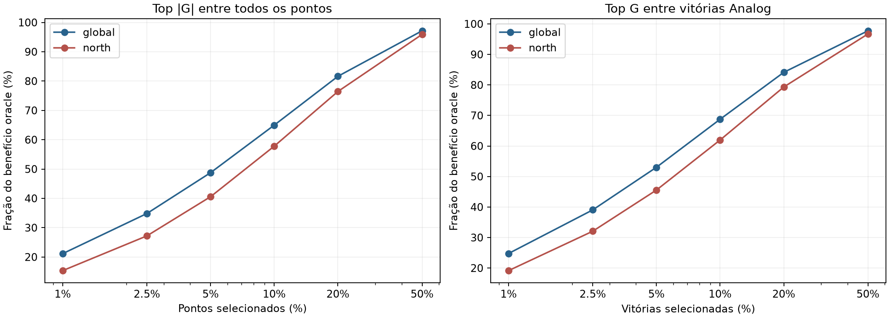
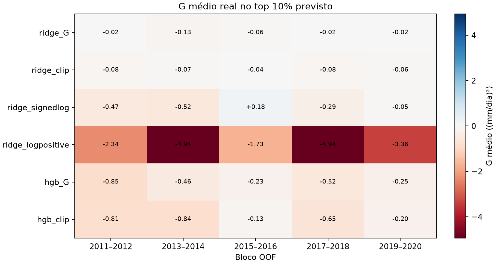
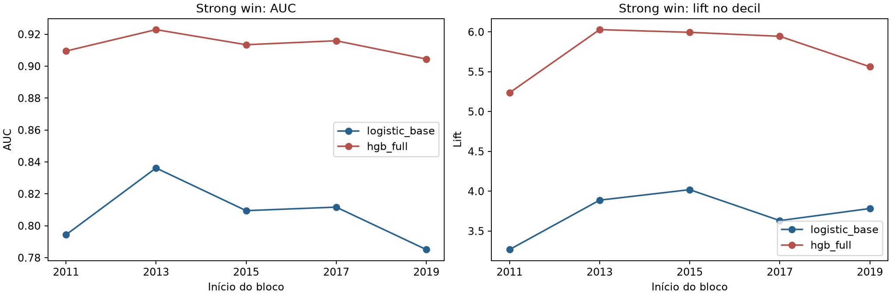
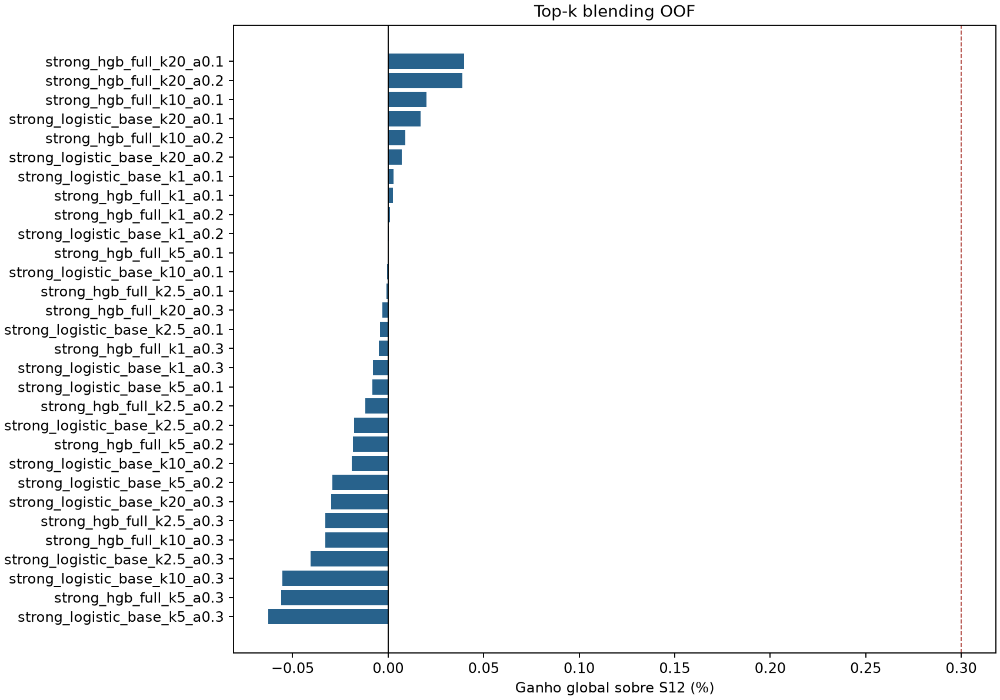
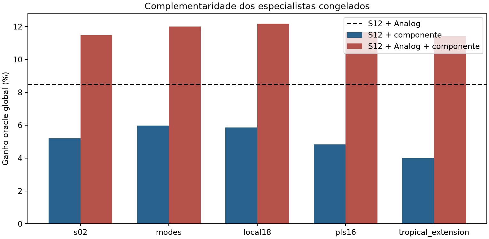

# Rodada 28 — magnitude da vantagem S12 × Analog

**Decisão predefinida: D.** Oracles triplos com componentes congelados acrescentam >=1 p.p. ao oracle S12×Analog; segundo especialista individual ainda é melhor Analog.

## Método e janelas

G = perda quadrática S12 − perda quadrática Analog. G>0 favorece Analog; G+=max(G,0) é exatamente a redução pontual de SSE do oracle duro. Os seis blocos 2009–2020 entram na decomposição e comparação de componentes. As sondas OOF de magnitude e strong wins usam 2011–2020, com treino apenas em blocos anteriores. Nenhuma previsão meta para 2009–2010 foi inventada.

## 1. De onde vem o ganho do oracle?

| Área | Ganho oracle RMSE | Vitórias Analog | Top 1% | Top 2,5% | Top 5% | Top 10% | Top 20% | Top 50% |
| --- | ---: | ---: | ---: | ---: | ---: | ---: | ---: | ---: |
| global | 8.49% | 46.72% | 21.1% | 34.8% | 48.8% | 65.0% | 81.6% | 97.1% |
| north | 9.00% | 47.72% | 15.4% | 27.2% | 40.6% | 57.8% | 76.4% | 95.9% |

A tabela acima ranqueia por |G| **todos os pontos**, inclusive grandes perdas do Analog. Se o denominador for somente vitórias G>0, os top 10% positivos concentram 68.8% do benefício global. Assim, poucos ganhos grandes explicam parte importante do oracle, mas |G| sozinho não identifica o sentido da escolha.

| Bloco | Top 1% | Top 10% | Ganho oracle |
| --- | ---: | ---: | ---: |
| 2009–2010 | 17.2% | 62.7% | 7.91% |
| 2011–2012 | 21.5% | 65.6% | 9.40% |
| 2013–2014 | 20.4% | 65.4% | 8.72% |
| 2015–2016 | 21.8% | 65.6% | 8.54% |
| 2017–2018 | 22.4% | 63.7% | 7.92% |
| 2019–2020 | 24.1% | 66.6% | 8.59% |

As mesmas decomposições por ano, latitude, setor norte e estação, para todos os seis percentuais e para G positivo, estão em [decomposition.json](decomposition.json).

## 2. G, G+ e vitória simples em OOF

Ridge foi ajustado para G bruto, G limitado por Q99 do treino, log assinado e log de G+. HGB conservador foi ajustado para G bruto e limitado. Z usa as probabilidades congeladas da Rodada 27. Todos os R² abaixo avaliam **G bruto** frente à média G do treino anterior; as transformações log foram invertidas para essa métrica. R² pequeno não é critério de parada isolado.

| Score | R² G por bloco (2011, 2013, 2015, 2017, 2019) | G médio top 10% por bloco | Blocos com G top 10% >0 |
| --- | --- | --- | ---: |
| ridge_G | -0.021, +0.028, -0.012, +0.046, +0.029 | -0.025, -0.132, -0.062, -0.023, -0.020 | 0/5 |
| ridge_clip | -0.016, +0.020, -0.001, +0.031, +0.023 | -0.077, -0.075, -0.037, -0.079, -0.057 | 0/5 |
| ridge_signedlog | +0.006, -0.006, +0.006, +0.041, +0.028 | -0.473, -0.524, +0.184, -0.291, -0.051 | 1/5 |
| ridge_logpositive | -0.037, -0.054, -0.025, -0.070, -0.035 | -2.343, -4.940, -1.726, -4.939, -3.361 | 0/5 |
| hgb_G | -0.035, +0.037, -0.010, +0.030, +0.027 | -0.851, -0.460, -0.227, -0.525, -0.252 | 0/5 |
| hgb_clip | -0.025, +0.017, +0.005, +0.016, +0.025 | -0.815, -0.840, -0.126, -0.648, -0.199 | 0/5 |
| Z_logistic_base | —, —, —, —, — | -0.527, -4.670, -0.630, -2.229, -0.179 | 0/5 |
| Z_hgb_full | —, —, —, —, — | -0.388, -0.441, +0.175, -0.911, +0.110 | 2/5 |

Os arquivos `YYYY_advantage.json` incluem Pearson, Spearman, R² por ano, os decis de score e os top 1%, 2,5%, 5%, 10% e 20% previstos com RMSE S12/Analog, vitórias e fração G+.

## 3. Strong wins

Evento: G maior que Q90 dos G positivos de todos os blocos norte anteriores. O limiar de cada corte foi ajustado sem seu próprio alvo. AUC/AP/lift detectam grandes vitórias positivas, mas não penalizam as grandes perdas negativas que podem coexistir no mesmo decil de score.

| Bloco | Limiar G | Modelo | Prevalência | AUC | AP | Lift decil | Ganho Brier | ECE | G médio top 10% score |
| --- | ---: | --- | ---: | ---: | ---: | ---: | ---: | ---: | ---: |
| 2011–2012 | 6.617 | logistic_base | 5.33% | 0.794 | 0.156 | 3.27× | +0.0013 | 0.018 | -2.376 |
| 2011–2012 | 6.617 | hgb_full | 5.33% | 0.909 | 0.257 | 5.24× | +0.0081 | 0.012 | -1.785 |
| 2013–2014 | 6.864 | logistic_base | 4.45% | 0.836 | 0.167 | 3.89× | +0.0021 | 0.005 | -4.783 |
| 2013–2014 | 6.864 | hgb_full | 4.45% | 0.923 | 0.251 | 6.03× | +0.0072 | 0.014 | -5.066 |
| 2015–2016 | 6.760 | logistic_base | 4.45% | 0.809 | 0.183 | 4.02× | +0.0025 | 0.005 | -0.947 |
| 2015–2016 | 6.760 | hgb_full | 4.45% | 0.913 | 0.261 | 5.99× | +0.0066 | 0.009 | -2.362 |
| 2017–2018 | 6.652 | logistic_base | 4.44% | 0.812 | 0.168 | 3.63× | +0.0024 | 0.004 | -2.990 |
| 2017–2018 | 6.652 | hgb_full | 4.44% | 0.916 | 0.272 | 5.94× | +0.0071 | 0.007 | -5.130 |
| 2019–2020 | 6.588 | logistic_base | 4.69% | 0.785 | 0.175 | 3.78× | +0.0025 | 0.004 | -1.159 |
| 2019–2020 | 6.588 | hgb_full | 4.69% | 0.904 | 0.270 | 5.56× | +0.0067 | 0.004 | -3.898 |

### Ranking por probabilidade de strong win (HGB)

Médias das cinco avaliações por fração selecionada em cada bloco; G médio negativo indica que as perdas grandes do Analog ainda superam suas grandes vitórias no grupo.

| Top previsto | G médio | Fração de G+ oracle capturada | Ganho Analog puro vs S12 |
| ---: | ---: | ---: | ---: |
| 1% | -4.983 | 6.1% | -8.26% |
| 2.5% | -5.626 | 13.9% | -9.70% |
| 5% | -5.129 | 27.4% | -8.80% |
| 10% | -3.648 | 48.3% | -7.18% |
| 20% | -2.191 | 69.1% | -5.58% |

Calibração por dez faixas e métricas por ano estão nos JSONs de cada corte. O ranking completo dos scores strong win está em [strong_ranking.json](strong_ranking.json).

## 4. Top-k blending e expected gain

Nenhum regressor contínuo passou o critério pré-fixado de G positivo no top 10% em 4/5 blocos e 7/10 anos. Os dois classificadores strong win passaram AUC, lift e Brier em 5/5 blocos; por isso apenas seus scores receberam top-k. O expected-gain gating por G bruto foi interrompido pelo critério de parada, sem ajustar f(Ghat) após os resultados.

G negativo no grupo significa que trocar integralmente S12 por Analog piora a perda média. Uma mistura pequena ainda pode ajudar: se δ=Analog−S12, a redução de perda da mistura com peso α é `α(G+δ²)−α²δ²`. Por isso medimos RMSE do blend diretamente, sem inferi-lo do sinal de G.

| Método, 2011–2020 | RMSE global | Ganho vs S12 | Blocos | Anos | Meses |
| --- | ---: | ---: | ---: | ---: | ---: |
| s12 | 1.756391 | +0.000% | — | — | — |
| fixed10_global | 1.755298 | +0.062% | — | — | — |
| logistic_base_0.3_round27 | 1.755065 | +0.075% | — | — | — |
| oracle | 1.604950 | +8.622% | — | — | — |
| strong_hgb_full_k20_a0.1 | 1.755692 | +0.040% | 4/5 | 7/10 | 62/120 |
| strong_hgb_full_k20_a0.2 | 1.755710 | +0.039% | 2/5 | 7/10 | 60/120 |
| strong_hgb_full_k10_a0.1 | 1.756038 | +0.020% | 3/5 | 7/10 | 61/120 |
| strong_logistic_base_k20_a0.1 | 1.756093 | +0.017% | 3/5 | 7/10 | 62/120 |
| strong_hgb_full_k10_a0.2 | 1.756231 | +0.009% | 3/5 | 6/10 | 61/120 |
| strong_logistic_base_k20_a0.2 | 1.756267 | +0.007% | 3/5 | 6/10 | 60/120 |
| strong_logistic_base_k1_a0.1 | 1.756341 | +0.003% | 3/5 | 6/10 | 57/120 |
| strong_hgb_full_k1_a0.1 | 1.756345 | +0.003% | 4/5 | 8/10 | 69/120 |
| strong_hgb_full_k1_a0.2 | 1.756373 | +0.001% | 4/5 | 7/10 | 68/120 |
| strong_logistic_base_k1_a0.2 | 1.756387 | +0.000% | 2/5 | 6/10 | 55/120 |

Todas as 30 combinações k×alpha, RMS da mudança, setores e métricas por bloco/ano estão em [policy.json](policy.json). A melhor linha foi observada após ver a tabela e não é uma candidata selecionada.

## 5. Assinatura dos grandes ganhos e perdas

Para cada corte, [signatures.json](signatures.json) contém quintis definidos no treino anterior de todas as 108 features, mês e estação. Compara G médio, vitória comum, strong win Analog e uma grande vitória S12 simétrica (G abaixo do negativo do mesmo limiar). Essa última é somente descritiva.

| Feature | Quintil | Strong Analog | Strong S12 | G médio |
| --- | ---: | ---: | ---: | ---: |
| climatology | 0 | 0.02% | 0.03% | -0.047 |
| climatology | 4 | 13.74% | 18.68% | -1.582 |
| s12 | 0 | 0.04% | 0.06% | -0.078 |
| s12 | 4 | 14.05% | 19.02% | -1.662 |
| s12_anomaly | 0 | 4.21% | 7.12% | -0.737 |
| s12_anomaly | 4 | 14.45% | 18.60% | -1.485 |
| analog_minus_s12 | 0 | 13.26% | 17.09% | -1.207 |
| analog_minus_s12 | 4 | 9.98% | 15.10% | -1.438 |
| member_std | 0 | 0.48% | 0.86% | -0.163 |
| member_std | 4 | 13.23% | 18.63% | -1.782 |
| consensus_ratio | 0 | 3.39% | 4.78% | -0.437 |
| consensus_ratio | 4 | 7.45% | 10.97% | -1.041 |
| continental_pc_1 | 0 | 3.78% | 7.58% | -1.130 |
| continental_pc_1 | 4 | 5.20% | 6.67% | -0.468 |
| tropical_pc_1 | 0 | 3.80% | 5.69% | -0.283 |
| tropical_pc_1 | 4 | 4.86% | 6.61% | -0.503 |
| local_context_7 | 0 | 0.48% | 1.39% | -0.249 |
| local_context_7 | 4 | 10.31% | 13.47% | -1.272 |

## 6. O Analog é um segundo especialista especial?

Os cinco componentes já existentes foram comparados sem treino novo. O oracle pareado S12×Analog é 8,49% global. Um oracle triplo usa o alvo observado para escolher entre três mapas e não pode ser interpretado como ganho capturável.

| Componente | RMSE puro | Oracle S12×componente | Oracle S12×Analog×componente | Acréscimo sobre oracle duplo |
| --- | ---: | ---: | ---: | ---: |
| s02 | 1.815 | 5.21% | 11.49% | +2.99 p.p. |
| modes | 1.831 | 5.98% | 12.00% | +3.51 p.p. |
| local18 | 1.812 | 5.87% | 12.18% | +3.68 p.p. |
| pls16 | 1.807 | 4.83% | 11.66% | +3.17 p.p. |
| tropical_extension | 1.805 | 3.99% | 11.43% | +2.93 p.p. |

Analog supera cada componente testado como **segundo** especialista pelo upper bound pareado. Todos acrescentam mais de 1 ponto percentual ao oracle como **terceiro** mapa, acionando D pela regra pré-fixada. Isso aponta potencial de um conjunto mais amplo; não prova que um componente isolado substitua Analog nem que o ganho triplo seja operacional.

## Decisão científica

**Classe D.** Oracles triplos com componentes congelados acrescentam >=1 p.p. ao oracle S12×Analog; segundo especialista individual ainda é melhor Analog.

Há uma constatação secundária do tipo B: strong wins são previsíveis como evento, mas o score não localiza vantagem líquida positiva suficiente para melhorar RMSE. O melhor top-k ganhou 0.040% global nos cinco blocos, capturando apenas 0.46% do ganho de RMSE do oracle nessa mesma janela e ficando abaixo do gate da Rodada 27. Os resultados OOF de 2009–2020 já foram reutilizados em várias decisões; há viés de seleção. Nenhuma S14, CSV, treino final, confirmação ou submissão. A [auditoria independente](audit.json) refez as perdas, limiares e políticas a partir dos arquivos OOF. [Protocolo](../../../experiments/ROUND28.md).
